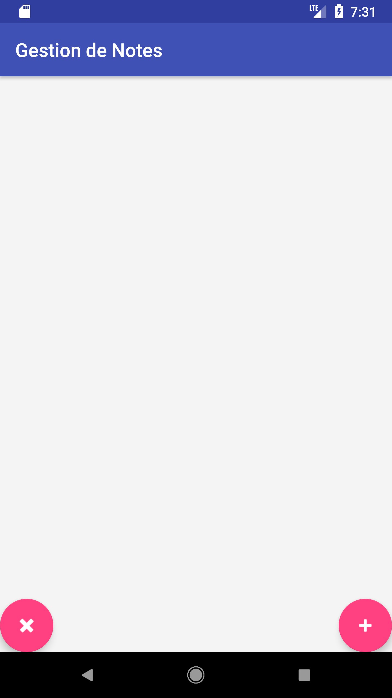
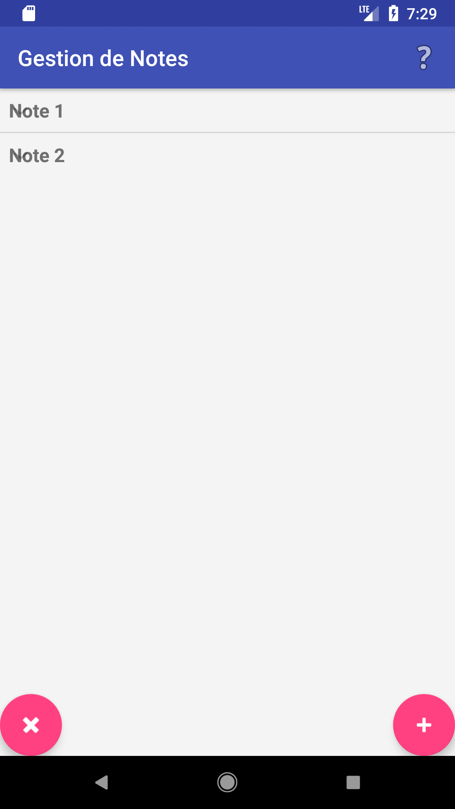
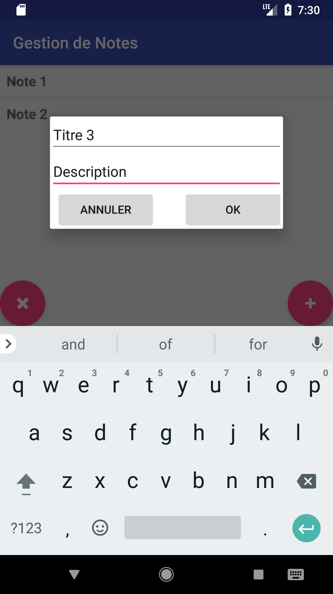

# Gestion de Note

Application android pour créer des notes composées d'un titre et d'une description

La sauvegarde des notes s'effectue dans un fichier au format JSON

Aerçu de l'écran d'acceuil : 

Aerçu de l'écran d'acceuil : 

Boite de dialogue ajout note : 

