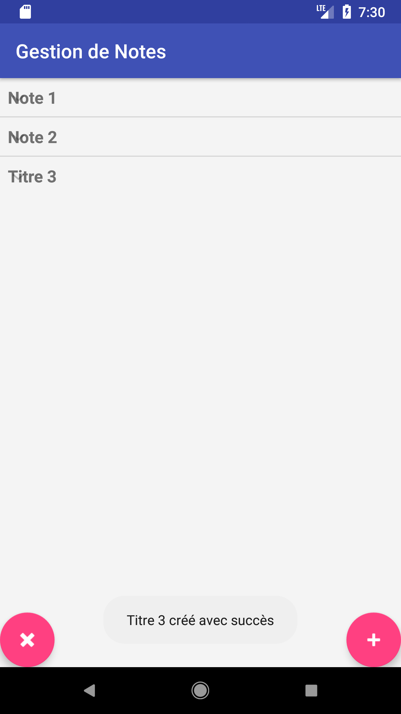
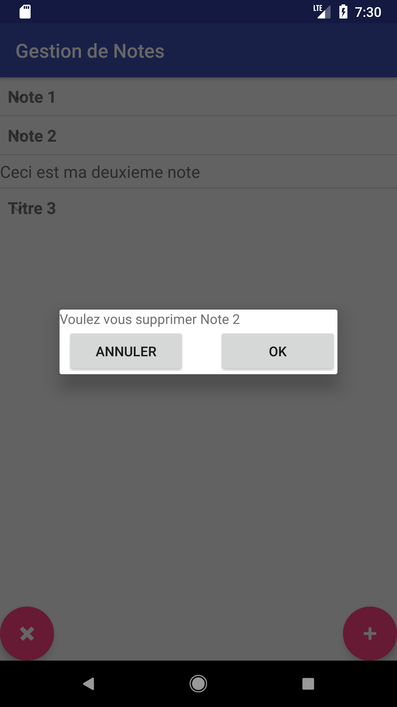
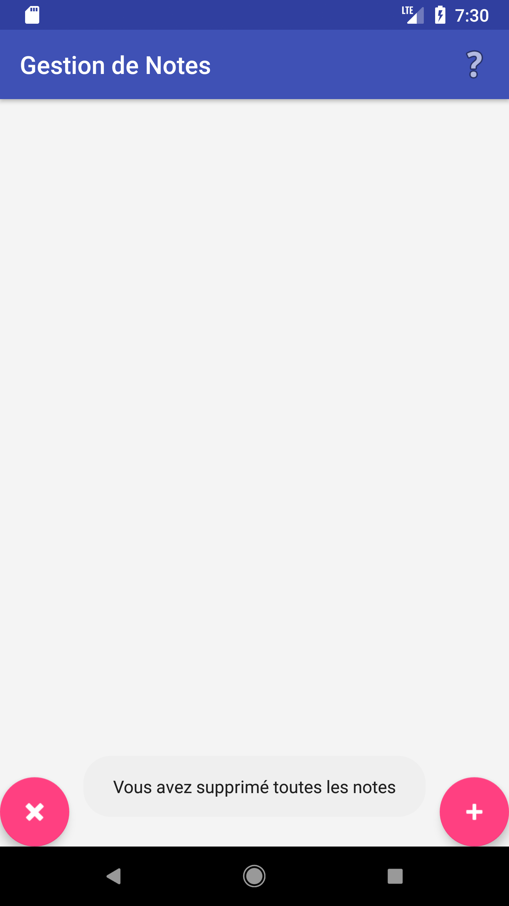

# Gestion de Note

Application android pour créer des notes composées d'un titre et d'une description

La sauvegarde des notes s'effectue dans un fichier au format JSON

<h4> Aperçu de l'écran d'acceuil :  

<h4> Aperçu de l'écran d'acceuil contenant des notes: 

<h4> Boite de dialogue ajout note : 

<h4> Notification ajout note : 

<h4> Boite de dialogue suppression note : 

<h4> Notification après suppression de toutes les notes : 

